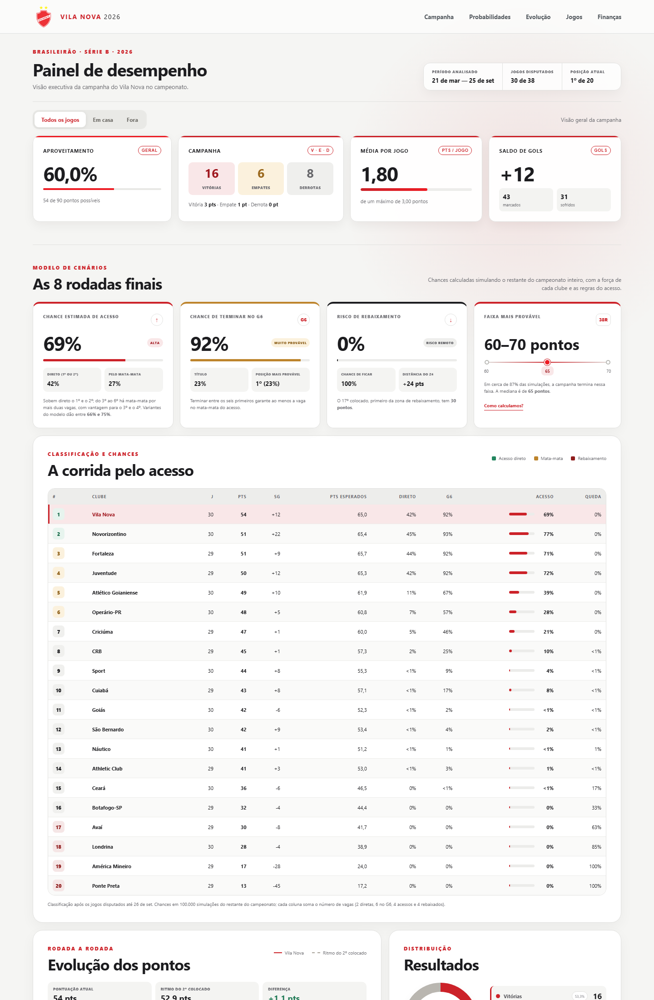
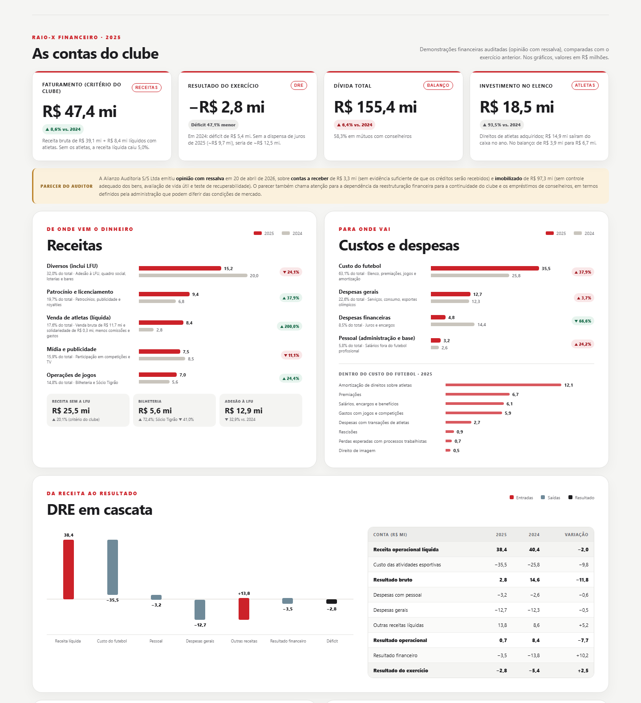

  

<h1 align="center">Dashboard Gerencial — Vila Nova na Série B 2026</h1>

  Projeto de análise de dados esportivos que transforma os resultados da campanha do Vila Nova em indicadores de desempenho, tendências e chances de acesso calculadas por simulação do campeonato inteiro, com um raio-x das finanças do clube.

  
  
  
  
  

## Sobre o projeto

Esta dashboard acompanha a campanha do Vila Nova Futebol Clube na Série B de 2026 sob uma perspectiva gerencial. O painel consolida os resultados jogo a jogo, compara o desempenho dentro e fora de casa e converte a campanha em informações úteis para tomada de decisão.

As chances de título, acesso, G6 e rebaixamento vêm de uma **simulação de Monte Carlo do restante do campeonato inteiro**. Ela considera a força de cada clube, os jogos que faltam para todos e as regras do regulamento da CBF.

A seção **Raio-X financeiro** traz os números das demonstrações financeiras de 2025, extraídos do PDF publicado pelo clube: receitas, custos, DRE, endividamento, fluxo de caixa e indicadores do Fair Play Financeiro da CBF (SSF). As demonstrações foram auditadas com **opinião com ressalva** (contas a receber e imobilizado).

## Panorama analisado

| Indicador | Resultado |
|---|---:|
| Posição na tabela | 1º lugar (líder) |
| Jogos disputados | 30 |
| Pontos conquistados | 54 |
| Campanha | 16 vitórias, 6 empates e 8 derrotas |
| Aproveitamento | 60,0% |
| Média de pontos | 1,80 por jogo |
| Gols | 43 marcados e 31 sofridos |
| Saldo de gols | +12 |

Os dados do Vila Nova vão até 25 de setembro de 2026 (30ª rodada). A classificação e a simulação usam os jogos de todos os clubes encerrados até 26 de setembro de 2026.

## Principais insights

- **Rendimento em casa:** 84,4% de aproveitamento no OBA, contra 35,6% fora.
  - A diferença, de 49 pontos percentuais, é bem maior que a média da Série B (17 p.p.) e clara nos números do time.
  - O tamanho dela, porém, é impreciso, e parte vem da tabela. Contra os mesmos 11 adversários enfrentados em casa e fora, o aproveitamento foi de 79% em casa e 48% fora.
- **Pontos por mando:** dos 54 pontos, 38 vieram em casa e 16 fora. Em 15 jogos como mandante, a única derrota foi para o Sport (0 × 1).
- **Gols por tempo:** os gols marcados se dividem por igual entre os tempos (22 × 21). Dos 31 gols sofridos, 18 saíram no 1º tempo (58%), acima da média da Série B (44,5%), mas dentro da variação esperada para 31 gols. A diferença vem toda dos jogos fora; em casa foram 5 × 6.
- **Gols sofridos fora:** como visitante, o Vila Nova sofreu 13 dos 20 gols no 1º tempo (saldo de −8 no 1º tempo e 0 no 2º). O número depende muito de três jogos, Ceará, CRB e Athletic, que somam 8 desses 13 gols. Com 15 partidas, a diferença entre os tempos não se distingue do acaso (p ≈ 0,26 contra uma divisão meio a meio; p ≈ 0,18 contra a média dos mandantes da Série B).
- **Vantagem no intervalo:** nas 11 vezes em que foi para o intervalo vencendo (9 delas em casa), o time venceu. Na Série B, quem vai vencendo ao intervalo vence 72% das vezes.
- **Ritmo:** após 30 rodadas, a equipe está 1,1 ponto acima do ritmo de quem termina em 2º. A simulação projeta 67 pontos para o 2º colocado.
- **Pontuação final:**
  - Na média atual de 1,80 ponto por jogo, o time terminaria com cerca de 68 pontos.
  - Considerando a força dos adversários restantes (4 deles são concorrentes diretos), a expectativa é de cerca de 11 pontos nos 8 jogos finais.
  - Na simulação, cerca de 87% dos cenários terminam entre 60 e 70 pontos, com mediana de 65.
- **Chances estimadas:**
  - cerca de **69% de acesso** (42% direto e 27% pelo mata-mata);
  - **23% de título**;
  - **92% de terminar no G6**;
  - risco de rebaixamento nulo.

  Variantes do modelo dão entre 66% e 75% de acesso. Apesar de líder, o Vila Nova tem a menor chance de acesso entre os quatro primeiros (Novorizontino 77%, Juventude 72%, Fortaleza 71%): tem saldo menor (+12, contra +22 do Novorizontino) e ainda enfrenta os três, além do Criciúma.

## Revisão estatística (27/09/2026)

A primeira versão do painel mostrava **91,8% de chance de acesso** (84,4% direto). Uma revisão independente confirmou que a conta estava correta, mas concluiu que o modelo era inadequado e superestimava o líder:

- **Referências fixas no lugar da posição.** O modelo usava pontuações fixas (65 pontos para o acesso direto, 60 para o G6) em vez de comparar o time com os rivais. Com 65 pontos, o Vila Nova fica entre os dois primeiros em só cerca de 35% das simulações.
- **Campanha em casa tomada ao pé da letra.** As 12 vitórias em 15 jogos viravam 76% de chance de vitória em cada jogo em casa, sem regressão à média.
- **Adversários ignorados.** Dos 8 jogos restantes, 4 são contra concorrentes diretos.

A revisão comparou dois simuladores independentes do campeonato:
- gols de Poisson: 67% de acesso;
- ratings Elo calibrados em 1.900 jogos: 71%.

Um backtest com 18 temporadas da Série B (2008–2025) mostrou que a simulação do campeonato erra significativamente menos que as referências fixas. Entre os times que o modelo antigo colocava com 75% a 95% de chance de "acesso direto" aos 30 jogos, só 4 de 15 terminaram entre os dois primeiros. O painel atual usa a simulação.

## Raio-X financeiro 2025

| Indicador | 2025 | 2024 |
|---|---:|---:|
| Faturamento (receita bruta + resultado líquido com atletas, critério do clube) | R$ 47,4 mi | R$ 43,7 mi |
| Receita operacional líquida | R$ 38,4 mi | R$ 40,4 mi |
| Receita sem a adesão à LFU (critério do clube) | R$ 25,5 mi | R$ 21,2 mi |
| Venda de atletas (resultado líquido) | R$ 8,4 mi | R$ 2,8 mi |
| Custo do futebol | R$ 35,5 mi | R$ 25,8 mi |
| Resultado operacional | R$ 0,7 mi | R$ 8,4 mi |
| Resultado do exercício | déficit de R$ 2,8 mi | déficit de R$ 5,4 mi |
| Dívida total (passivo sem as subvenções) | R$ 155,4 mi | R$ 146,1 mi |
| Direitos de atletas adquiridos | R$ 18,5 mi | R$ 9,6 mi |
| Caixa no fim do ano | R$ 16 mil | R$ 312 mil |

Os valores de 2024 são os reapresentados nas demonstrações de 2025 (nota 2.15). As demonstrações de 2024 foram auditadas por outra empresa, que emitiu relatório com modificações em 30/04/2025.

- **Parecer do auditor.** A Alianzo Auditoria emitiu, em 20/04/2026, **opinião com ressalva** sobre:
  - as contas a receber de R$ 3,3 mi, sem evidência suficiente de que serão recebidas;
  - o imobilizado de R$ 97,3 mi, sem controle adequado dos bens, avaliação de vida útil e teste de recuperabilidade.

  O parecer também traz um parágrafo sobre continuidade operacional, que depende do sucesso da reestruturação financeira, e uma ênfase (sem ressalva) sobre os empréstimos de conselheiros. Eles foram feitos em termos definidos pela administração, e o resultado poderia ser diferente em condições normais de mercado.
- **Receitas.** Sem a adesão à LFU, a receita cresceu 20,1%, com a bilheteria subindo 72,4% e os patrocínios 46,5%. O Sócio Tigrão caiu 41,0%. Sem os atletas, a receita líquida total caiu 5,0%, puxada pela redução da LFU.
- **Venda de atletas.** O resultado líquido triplicou, de R$ 2,8 mi para R$ 8,4 mi. A venda bruta subiu 55% (de R$ 7,6 mi para R$ 11,7 mi), e comissões e gastos caíram de 63% para 31% do valor negociado.
- **Custos.** O custo do futebol subiu 37,9%, e o maior aumento veio da amortização dos direitos de atletas (de R$ 5,6 mi para R$ 12,1 mi). O resultado operacional caiu de R$ 8,4 mi para R$ 0,7 mi.
- **Despesas financeiras.** Caíram 66,6% porque os conselheiros dispensaram os juros dos mútuos em 2025. Pela estimativa do clube, isso evitou cerca de R$ 9,7 mi em encargos.
- **Resultado.** O déficit caiu de R$ 5,4 mi para R$ 2,8 mi, mas a dispensa de juros vale só para 2025. Sem ela, o déficit teria sido de cerca de R$ 12,5 mi. Sem nova dispensa, os juros (0,5% ao mês mais INPC sobre R$ 90,6 mi) voltam a pesar a partir de 2026.
- **Dívida.** Soma R$ 155,4 mi, dos quais 58% são mútuos com conselheiros. O patrimônio social é negativo em R$ 62,3 mi.
- **Fair Play Financeiro.** O clube cumpre 3 de 4 indicadores. A exceção é o endividamento de curto prazo, de 115,5%, cujo limite cai para 45% a partir de 2030.

## O que a dashboard entrega

- KPIs de pontos, aproveitamento, média por jogo e saldo de gols, com a posição atual na tabela;
- distribuição de vitórias, empates e derrotas;
- evolução da pontuação rodada a rodada, comparada ao ritmo de quem termina em 2º;
- comparação entre desempenho em casa e como visitante, com a média da liga;
- gols marcados e sofridos em cada tempo, com teste estatístico para não apontar diferenças que o acaso explica;
- rendimento por períodos da competição e indicadores de consistência;
- chances de título, acesso direto, G6, acesso pelo mata-mata e rebaixamento;
- tabela "A corrida pelo acesso", com a classificação e as chances dos 20 clubes;
- chances de vitória, empate e derrota em cada um dos próximos jogos;
- simulador de metas de pontos, com a chance de atingir cada meta e de terminar entre os dois primeiros com ela;
- tabela completa com busca por adversário e filtros por mando de campo;
- raio-x financeiro com o parecer do auditor, receitas, custos, DRE em cascata, dívida, fluxo de caixa e indicadores do Fair Play Financeiro (SSF).

## Metodologia

### Pontuação e aproveitamento

- Vitória: 3 pontos;
- empate: 1 ponto;
- derrota: 0 ponto;
- aproveitamento: pontos conquistados ÷ pontos possíveis.

O painel considera somente partidas com <code>status</code> igual a <code>finished</code> e resultado identificado como <code>V</code>, <code>E</code> ou <code>D</code>.

Na análise por tempo, um tempo só é apontado como concentrador de gols quando o teste binomial bilateral contra uma divisão meio a meio dá p < 0,10. Sem isso, o painel mostra "sem diferença clara entre os tempos".

### Simulação do campeonato

O script <code>simulacao.py</code> lê todos os jogos da liga (<code>serie_b_2026_jogos.csv</code>) e grava <code>simulacao_2026.js</code>, carregado pelo painel.

1. **Modelo de gols.** Os gols de cada jogo seguem uma distribuição de Poisson que depende do ataque de cada clube, da defesa do adversário e de uma vantagem de mando comum a todos. É o modelo de Maher. Os parâmetros são estimados por máxima verossimilhança nos jogos disputados, com encolhimento (ridge). A intensidade do encolhimento é escolhida por validação temporal deslizante: a partir da metade dos jogos, o modelo treina até cada corte e prevê os 20 jogos seguintes (hoje, 7 cortes), medindo o acerto em vitória, empate e derrota. A validação quase não distingue os valores testados; por isso o painel mostra também a faixa das variantes (passo 5).
2. **Jogos restantes.** São todos os confrontos de turno e returno ainda não disputados. Assim, jogos adiados ou em andamento também entram na conta.
3. **Temporadas simuladas.** São 100 mil, com semente fixa registrada no arquivo, seguindo o regulamento da CBF (REC Série B 2026):
   - Art. 12: desempate por vitórias, saldo, gols pró e confronto direto; cartões viram sorteio. Pelo § 2º, o confronto direto só vale quando exatamente dois clubes empatam em pontos e usa o placar somado dos dois jogos;
   - Art. 13: mata-mata 3º x 6º e 4º x 5º em ida e volta, com a volta na casa do mais bem colocado. Decide a soma de pontos nos dois jogos, depois o saldo e, persistindo o empate, avança o mais bem colocado (equivale ao placar agregado com vantagem para ele);
   - Art. 5: sobem os 2 primeiros e os 2 vencedores do mata-mata; caem os 4 últimos.
4. **Checagens.** O script interrompe a gravação se:
   - a base não tiver 20 clubes ou, quando traz a tabela completa (ESPN), não tiver 380 jogos e 19 jogos por clube como mandante e como visitante;
   - houver jogo encerrado sem placar ou sem data, ou confronto em duplicidade;
   - os jogos restantes não baterem com os jogos não encerrados da base;
   - as somas por temporada não derem 4 acessos, 2 vagas diretas e 4 rebaixados.

   Uma base só com jogos encerrados (Football Soccer API) não tem o calendário para comparar: um jogo disputado que falte nela seria simulado como pendente, e o script só avisa. Com poucos jogos disputados, as chances são marcadas como preliminares.
5. **Sensibilidade.** O script roda variantes com encolhimento fraco, encolhimento forte e peso maior para jogos recentes. O painel mostra a faixa resultante.

Se <code>simulacao_2026.js</code> não existir, o painel usa um modo reserva simplificado, que olha só a campanha do Vila Nova com regressão à média. Esse modo avisa na tela que tende a superestimar o líder.

### Dados financeiros

O script <code>extrair_financas.py</code> lê o texto do PDF das demonstrações financeiras com <code>pdfplumber</code> e grava <code>financas_2025.js</code>. Antes de gravar, ele confere se os números fecham:
- itens de cada nota contra seus subtotais;
- notas contra a DRE;
- ativo contra passivo e patrimônio;
- variação do caixa;
- movimentação dos direitos de atletas;
- composição da venda de atletas.

A tolerância é de R$ 2 mil; no documento, as diferenças de arredondamento não passam de R$ 1 mil. O script também lê do parecer do auditor o tipo de opinião e os valores das ressalvas.

- **Faturamento:** critério do relatório do clube, que soma a receita bruta da nota 15 ao resultado líquido da venda de atletas (nota 19). As bases são diferentes; por isso o painel mostra também a variação da receita líquida sem os atletas.
- **Receita sem a LFU:** receita líquida sem a adesão ao condomínio da LFU, rótulo que o clube chama de "recorrente". Os valores de 2024 foram reapresentados pelo clube.
- **Dívida:** passivo circulante e não circulante, sem as subvenções recebidas, como no relatório da administração.
  - Inclui receitas recebidas antecipadamente, como adiantamentos da CBF e patrocínios a apropriar.
  - Os componentes foram recalculados a partir do balanço e das notas 9 a 11. Por isso "outros passivos" aparece como R$ 18,3 mi; no gráfico do relatório aparece como R$ 17,9 mi, e as parcelas somam R$ 155,1 mi em vez do total de R$ 155,4 mi.
- **Fair Play Financeiro:** os indicadores e limites vêm do quadro "Sustentabilidade Financeira - SSF" do relatório da administração.

## Fontes de dados

O script <code>coleta_detalhada.py</code> coleta os jogos do Vila Nova e de todos os clubes da Série B a partir de uma de duas APIs REST:

- **Football Soccer API** (plano gratuito, 50 chamadas por dia): usada quando a variável <code>FSAPI_KEY</code> está definida. O script localiza o id do Vila Nova automaticamente e só detalha jogos encerrados, para caber na cota diária. Esse caminho não foi executado neste projeto, por falta de chave.
- **API pública da ESPN:** usada automaticamente quando não há chave. Não exige cadastro e traz também os jogos já agendados.

Mesmo sem chave, as duas fontes puderam ser comparadas no jogo Vila Nova 4 × 3 Náutico (14ª rodada), que está na base do projeto original, coletada pela Football Soccer API. Placar, placar do intervalo, finalizações, passes, escanteios, faltas e cartões coincidem com a ESPN.

As regras de acesso, rebaixamento e desempate seguem o Regulamento Específico da Competição (REC) da Série B 2026, publicado pela CBF.

Os dados financeiros vêm do **Relatório Anual da Administração e Demonstrações Financeiras 2025** do Vila Nova Futebol Clube. O relatório do auditor independente (Alianzo Auditoria, 20/04/2026) traz opinião com ressalva.

## Tecnologias utilizadas

- **Python e Pandas:** coleta, tratamento dos dados e criação de métricas;
- **NumPy e SciPy:** ajuste do modelo de gols e simulação de Monte Carlo;
- **pdfplumber:** extração dos números das demonstrações financeiras em PDF;
- **Streamlit:** publicação e disponibilização da aplicação;
- **JavaScript:** cálculos, filtros e renderização dos gráficos;
- **HTML e CSS:** estrutura, responsividade e identidade visual;
- **CSV:** armazenamento das bases consolidadas;
- **GitHub:** versionamento e integração com o deploy.

## Estrutura do projeto

<pre><code>analise_vila_nova/
├── app.js
├── coleta_detalhada.py                        # coleta os jogos e dispara a simulação
├── dashboard-preview.png
├── extrair_financas.py                        # extrai os números do PDF financeiro
├── financas-preview.png
├── financas_2025.js                           # dados financeiros (gerado)
├── index.html
├── README.md
├── requirements.txt                           # dependências do app (Streamlit)
├── requirements-dados.txt                     # dependências dos scripts de dados
├── serie_b_2026_jogos.csv                     # jogos de todos os clubes (gerado)
├── serie_b_2026_probabilidades.csv            # chances de cada clube (gerado)
├── server.js
├── simulacao.py                               # simulação do campeonato
├── simulacao_2026.js                          # resultado da simulação (gerado)
├── streamlit_app.py
├── styles.css
├── vila-nova-logo.png
└── vila_nova_serie_b_2026_todos_jogos.csv     # jogos do Vila Nova (gerado)
</code></pre>

## Executar localmente

### Streamlit

<pre><code>cd analise_vila_nova
python -m pip install -r requirements.txt
python -m streamlit run streamlit_app.py
</code></pre>

A aplicação será disponibilizada normalmente em <code>http://localhost:8501</code>.

### Versão HTML

<pre><code>node server.js
</code></pre>

Depois, acesse <code>http://localhost:8000</code>. O <code>index.html</code> também abre direto do disco. Nesse caso, o navegador bloqueia a leitura do CSV e o painel usa os dados incorporados no <code>app.js</code>, que refletem a última coleta. A simulação e as finanças funcionam normalmente.

## Atualização dos dados

Instale as dependências dos scripts de dados uma vez:

<pre><code>python -m pip install -r requirements-dados.txt
</code></pre>

Depois de cada rodada, rode a coleta. Ela baixa os jogos do Vila Nova e de todos os clubes e já recalcula a simulação:

<pre><code>python coleta_detalhada.py
</code></pre>

Para usar a Football Soccer API, informe a chave por variável de ambiente no PowerShell antes da coleta:

<pre><code>$env:FSAPI_KEY="SUA_CHAVE"
python coleta_detalhada.py
</code></pre>

Se a busca automática do clube falhar, defina também <code>$env:VILA_NOVA_ID="tm_..."</code>. A chave não deve ser gravada no código nem enviada ao GitHub.

Depois, envie ao GitHub os arquivos gerados: <code>vila_nova_serie_b_2026_todos_jogos.csv</code>, <code>serie_b_2026_jogos.csv</code>, <code>serie_b_2026_probabilidades.csv</code> e <code>simulacao_2026.js</code>. O Streamlit Community Cloud atualiza a aplicação sozinho.

### Dados financeiros

Baixe o PDF das demonstrações financeiras no site do clube e rode o extrator, informando o caminho do arquivo:

<pre><code>python extrair_financas.py caminho/para/demonstracoes-contabeis-2025.pdf
</code></pre>

O script mostra cada conferência e só grava <code>financas_2025.js</code> se todos os totais fecharem.

## Publicar no Streamlit Community Cloud

1. Envie esta pasta para um repositório público no GitHub.
2. Em [share.streamlit.io](https://share.streamlit.io), escolha **Create app** e selecione o repositório.
3. Informe a branch <code>main</code> e o arquivo principal <code>streamlit_app.py</code>.
4. Clique em **Deploy**. O Streamlit instala as dependências de <code>requirements.txt</code> e gera o link público.

## Competências demonstradas

- coleta e tratamento de dados via API;
- modelagem estatística de resultados e simulação de Monte Carlo com as regras da competição;
- validação de modelos com backtest e análise de sensibilidade;
- extração e validação de dados de demonstrações financeiras em PDF;
- definição e cálculo de indicadores esportivos e financeiros;
- análise exploratória e comunicação de insights;
- construção de dashboards responsivos;
- versionamento com Git e publicação em nuvem.

## Créditos

Adaptação para o Vila Nova do projeto [analise_nautico](https://github.com/pablohmelo02/analise_nautico), de [Pablo Melo](https://github.com/pablohmelo02). O escudo em <code>vila-nova-logo.png</code> foi obtido na ESPN e é marca do Vila Nova Futebol Clube.
